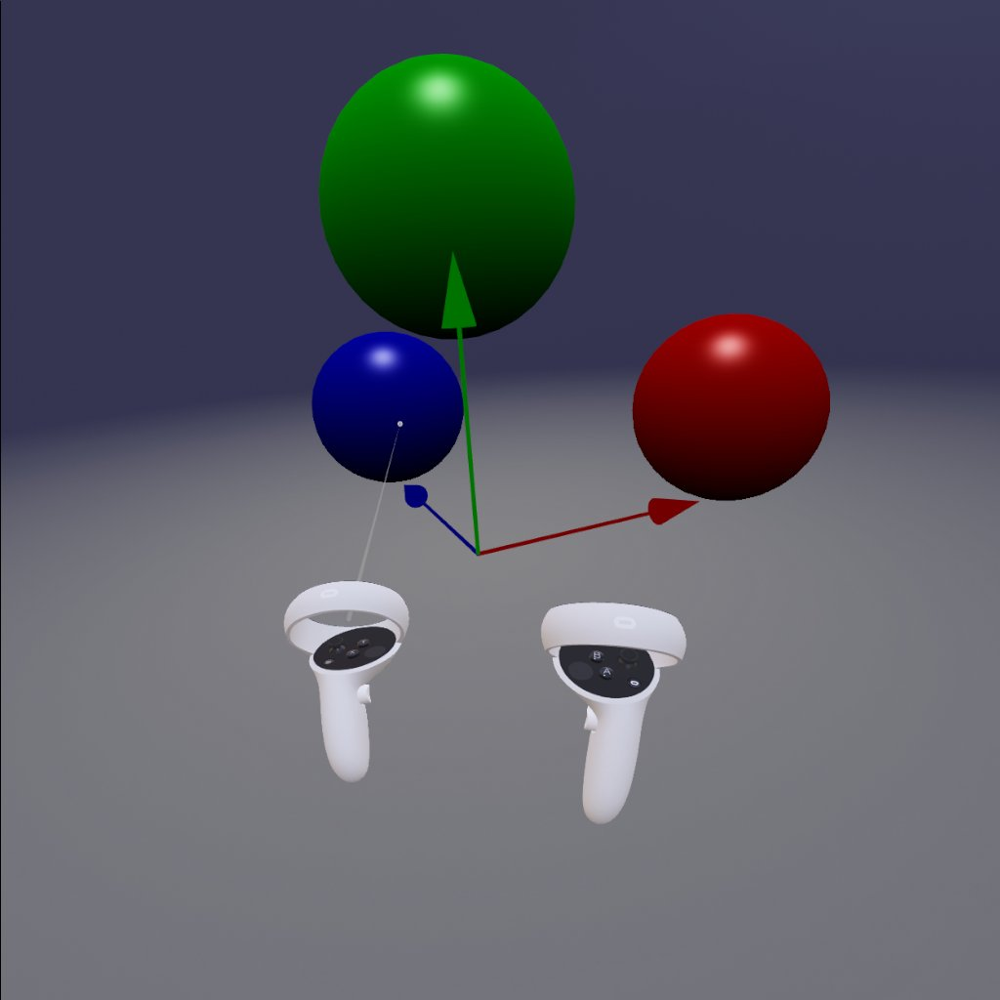

# WebXR-Vite-Babylon-Simple

Minimal setup for WebXR development using:

* [vite](https://vitejs.dev/)
* [typescript](https://www.typescriptlang.org/)
* [vue 3](https://vuejs.org/)
* [babylonjs 5](https://www.babylonjs.com/) (ES6)

Intentionally made minimal changes from the default vite scaffolding.

Uses the [ES6 packaging from Babylon.js](https://doc.babylonjs.com/divingDeeper/developWithBjs/treeShaking) and tree
shaking. With this repo and babylon.js 5.0.0-beta.7, vite is reporting a vendor build size of 2.5MB (562k gzipped). If
importing all of @babylonjs/core, the build size goes to ~4MB.

This repo includes enough setup so that controller models can be loaded
for [supported XR devices](https://github.com/immersive-web/webxr-input-profiles). This requires making sure the
GLTF/GLB loader is active.

Screenshot from within Meta/Oculus Quest 2 browser (v37, 2022-02):

